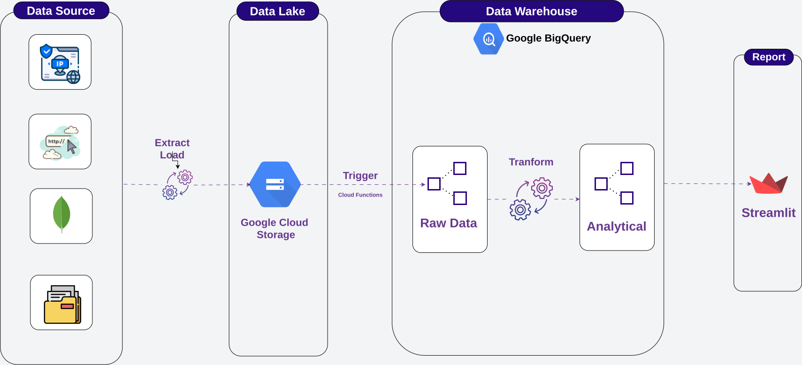
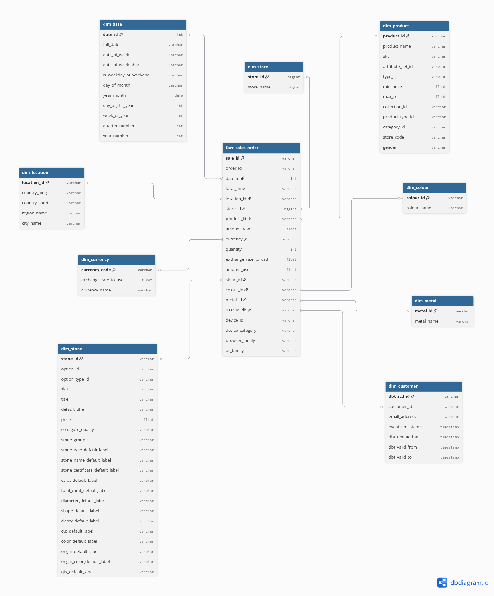

# 💎 Glamira Data Engineering Project - E-commerce Analytics

An end-to-end data engineering pipeline built with **Python**, **dbt**, and **Google Cloud Platform (GCP)** to collect,
process, and analyze data from the Glamira e-commerce platform. The project implements a modern data stack with a \*
\*Medallion Architecture** in BigQuery and **Event-Driven Automation\*\*.

---

## 📋 Table of Contents

- [Project Flow Diagram Overview](#project-flow-diagram-overview)
- [Data Pipeline Architecture](#-data-pipeline-architecture)
- [Tech Stack](#-tech-stack)
- [Project Structure](#-project-structure)
- [Features](#-features)
- [Data Modeling](#-data-modeling-dbt)
- [Configuration](#-configuration)
- [Getting Started](#-getting-started)
- [Deployment (Cloud Functions)](#-deployment-cloud-functions)
- [Monitoring](#-monitoring)

---

## Project Flow Diagram Overview



---

## 🚀 Data Pipeline Architecture

The pipeline is organized into modular stages, combining manual/scheduled extraction with **event-driven automation**
for seamless data ingestion.

| Stage                                 | Description                                                                                       | Orchestration       |
| :------------------------------------ | :------------------------------------------------------------------------------------------------ | :------------------ |
| **Stage 1: IP to Location**           | Enrich raw user IP addresses into geographic data using IP2Location LITE DB.                      | Manual/Local        |
| **Stage 2: PID Filter**               | Filters Product IDs (PIDs) and all associated Product URLs for crawling.                          | Manual/Local        |
| **Stage 3: Filter/Score Product Url** | Cleans, scores, and selects the optimal Product URLs for crawling to maximize efficiency.         | Manual/Local        |
| **Stage 4: Product Crawler**          | Asynchronous high-performance crawling for product info enrichment.                               | Manual/Local        |
| **Stage 5: Export to GCS**            | Consolidates and syncs processed data (JSON/BSON) to GCS in **Optimized Parquet** format.         | Manual/Local        |
| **Stage 6: BigQuery Load**            | **Automated** with **Cloud Functions** to ingest Parquet files from GCS into BigQuery raw tables. | **Cloud Functions** |
| **Stage 7: dbt Transform**            | Executes SQL transformations to build the analytical **Star Schema**.                             | dbt Cloud / Local   |

### 🔄 Event-Driven Flow

1. Data is exported as `.parquet` files to specific GCS folders.
2. A **Google Cloud Function** detects the upload event.
3. The function (and local loaders) triggers a **BigQuery Load Job** using `WRITE_APPEND` combined with **Time
   Partitioning** (TTL 30 days) for optimal Raw layer storage.
4. Data is immediately available in the `raw` layer for dbt transformations without relying on risky schema
   auto-detection.

---

## 🛠 Tech Stack

| Category                  | Technology                           |
| :------------------------ | :----------------------------------- |
| **Language**              | Python 3.13+                         |
| **Data Orchestration**    | Custom Python Runner (`main.py`)     |
| **Automation**            | Google Cloud Functions (Python 3.11) |
| **Storage (Raw/Staging)** | MongoDB, Google Cloud Storage (GCS)  |
| **Data Warehouse**        | Google BigQuery                      |
| **Transformation**        | dbt (data build tool)                |
| **Visualization**         | Streamlit, Plotly                    |
| **Cloud Provider**        | Google Cloud Platform (GCP)          |
| **Package Manager**       | uv                                   |

---

## 📁 Project Structure

```text
.
├── cloud_functions/           # Serverless automation
│   └── gcs_to_bq/
│       ├── main.py            # Cloud Function entry point
│       └── requirements.txt   # GCP Function dependencies
├── config/                    # Central configuration
│   ├── base.py                # Environment variables & constants
│   └── logger.py              # Standardized logging setup
├── extract/                   # Data collection logic
│   ├── ip/
│   │   ├── get_enriched_ip.py # Batch processes IP enrichment
│   │   └── ip_unique_filter.py # Filters unique IP addresses
│   └── product/
│       ├── pid_filter.py      # Filters unique Product IDs (PIDs)
│       └── product_crawler.py # Async high-performance crawler
├── loaders/                   # Data movement & synchronization
│   ├── main_gcs_export.py     # Main orchestrator for GCS export
│   ├── gcs_to_bq.py           # Manual BigQuery load orchestrator
│   ├── gcs_loader/            # GCS specific uploaders
│   │   ├── load_ip2location_to_gcs.py   # Syncs IP location JSONs to GCS
│   │   ├── load_product_info_to_gcs.py  # Syncs Product JSONs to GCS
│   │   └── load_summary_to_gcs.py       # Syncs massive Summary BSON to GCS
│   └── mongo_loader/          # MongoDB specific uploaders
│       └── load_enriched_ip_to_mongo.py # Loads enriched Geo-data
├── monitoring/                # Quality assurance & profiling
│   ├── data_profiler.py       # Profiling & data dictionaries
│   └── e2e_test.py            # End-to-end pipeline integration tests
├── processing/                # Transformation & Enrichment
│   ├── enricher/              # Data Enrichment (Lookup / HTML parsing)
│   │   ├── ip_enricher.py              # IP to Geo-location enrichment
│   │   └── product_info_enricher.py    # HTML parsing for product data
│   ├── filter/                # Data filtering logic
│   │   └── product_urls_filter.py      # Cleans and filters product URLs
│   └── normalizer/            # Data Normalization & Cleaning
│       ├── ip2location_normalizer.py   # Cleans IP Geo data
│       ├── product_info_normalizer.py  # Strictly casts Product to PyArrow schema
│       └── summary_normalizer.py       # Cleans complex nested Summary events
├── schema/                    # Schema definitions
│   └── schemas.py             # PyArrow & BigQuery schemas
├── transform/                 # dbt Transformation layer
│   └── glamira_dbt/
│       ├── models/            # Star Schema (Mart, Staging, Int)
│       ├── seeds/             # Static reference mappings (e.g., store mapping)
│       ├── snapshots/         # SCD Type 2 (dim_customer)
│       ├── macros/            # Custom SQL/JS-UDF macros
│       ├── dbt_project.yml    # dbt configuration
│       └── profiles.yml       # BQ connection profiles
├── utils/                     # Reusable helper functions
│   ├── checkpoint_utils.py    # Pipeline resume management
│   ├── data_transform_utils.py # Shared transform functions (safe_bool, safe_int...)
│   ├── gcs_upload_utils.py    # Shared GCS Parquet upload & batching logic
│   ├── file_saving_utils.py   # JSON/Parquet file handlers
│   ├── time_utils.py          # Time formatting utilities
│   └── field_extractor_utils.py # Nested field extraction helpers
├── data/                      # Local data cache (JSON/BSON/Parquet)
├── logs/                      # Execution and error logs
├── data_dictionary/           # Data profiling & metadata docs
├── checkpoint/                # Pipeline state for resumable jobs
├── dashboard.py               # Streamlit-based analytics dashboard
├── main.py                    # Main ETL orchestration script
├── pyproject.toml             # uv dependencies & project metadata
└── README.md                  # Project documentation
```

---

## ✨ Features

### ⚡ Optimized Performance

- **Local-First Processing**: IP2Location and Product Info are processed from local JSON batches, significantly reducing
  MongoDB overhead and API latency.
- **Asynchronous Crawling**: Apply `aiohttp` with `semaphores` and 'limit_per_host(TCPConnector)' to crawl thousands of products efficiently.

### 🤖 Serverless Automation

- **GCS Triggers**: BigQuery ingestion is fully automated. No manual script execution is required for the loading stage;
  simply upload to GCS.
- **Schema Evolution**: Cloud Functions support `ALLOW_FIELD_ADDITION`, allowing the pipeline to adapt to new data
  attributes automatically.

### 🏗 Enterprise Data Modeling

- **Medallion Architecture**: Clear separation between `staging`, `intermediate`, and `mart` layers.
  - **Staging Layer**: Extracts raw data, casts datatypes, and performs basic schema alignment (e.g., `stg_glamira__product`, `stg_glamira__summary`).
  - **Intermediate Layer**: Handles heavy data transformation.
    - `int_checkout_events`: Flattens and unnests complex JSON checkout log arrays.
    - `int_colour_options` & `int_stone_options`: Normalizes nested product sub-attributes.
    - `int_product_translated`, `int_colour_translated`, `int_metal_translated`, `int_stone_translated`: Executes deduplication (`QUALIFY ROW_NUMBER()`) and applies complex text processing (regex spelling corrections, single-pass JavaScript UDF translations) to prioritize English locales.
  - **Mart Layer**: The presentation layer for BI tools. Contains "Thin" dimensions (`dim_product`, `dim_colour`, `dim_metal`, `dim_stone`) that simply select from the intermediate layer, keeping the architecture exceptionally clean.
- **SCD Type 2 Tracking**: Historical versioning for the `dim_customer` dimension ensures accurate point-in-time
  analysis.
- **Star Schema**: Highly optimized for BI tools and complex analytical queries. Fact tables utilize `FARM_FINGERPRINT`
  for **INT64 surrogate keys** and implement `incremental` materialization (Merge strategy) to process large datasets
  swiftly.
- **Multi-language Dimension Normalization**: Resolves fan-out data duplication in product dimensions (`dim_metal`, `dim_colour`, `dim_stone`) using deterministic `QUALIFY ROW_NUMBER()` window functions, intelligently prioritizing English locales (`glus`, `glgb`, `glca`, `glau`).
- **Seed Mappings**: Leverages static CSV files to enforce business rules directly within the data warehouse:
  - `dim_store_mapping.csv`: Bridges raw numeric `store_id` values (from legacy events) with actual localized `store_code` strings (e.g., `glvn`, `glde`).
  - `exchange_rates.csv`: Provides static currency exchange rates for accurate financial normalization.
  - `product_category_translation.csv`: Acts as a dynamic dictionary for the intermediate layer to perform high-performance, single-pass text replacements via JS UDFs, ensuring diverse foreign product names are consistently translated into English.

---

## 📈 Analytics Dashboard (Streamlit)

The project includes a high-performance **Streamlit** dashboard for real-time data visualization:

- **Key Metrics**: Total sales, currency-wise revenue, and product interaction counts.
- **Geographic Insights**: Heatmaps showing user activity and sales by country (powered by `dim_location`).
- **Product Trends**: Analytics on popular colors, metals, and stone types.
- **Interactive Filtering**: Filter data by date ranges, store locations, and product categories.

To run the dashboard:

```bash
uv run python -m streamlit run dashboard.py
```

---

## 📊 Data Modeling (dbt)

The transformation layer builds a robust Star Schema within BigQuery:

- **Fact Tables**: `fact_sales_order` (sales transactions and product interactions).
- **Dimension Tables**:
  - `dim_product`, `dim_customer` (**SCD Type 2**), `dim_location`, `dim_currency`.
  - `dim_colour`, `dim_metal`, `dim_stone`, `dim_store`.
  - `dim_date` (Standardized time analysis).
- **Intermediate Tables**:
  - `int_checkout_events`: Flattens complex checkout log arrays.
  - `int_colour_options` & `int_stone_options`: Normalizes product attributes for the Star Schema.
  - `int_product_translated`: Deduplicates raw products and applies robust, regex-based string corrections and single-pass translations using a BigQuery JavaScript UDF.
  - `int_colour_translated`, `int_metal_translated`, `int_stone_translated`: Extracts deduplication logic and English name prioritization, adhering strictly to the Thin Mart philosophy.

### 🗄️ Schema Design



---

## ⚙️ Configuration

The system uses a `.env` file for secure configuration.

| Key                       | Description                                |
| :------------------------ | :----------------------------------------- |
| `MONGODB_URI`             | Connection string for the raw data source. |
| `GCS_BUCKET_NAME`         | Destination bucket for Parquet files.      |
| `BQ_PROJECT_ID`           | Your Google Cloud Project ID.              |
| `BQ_DATASET_ID`           | Targeted BigQuery dataset name.            |
| `GCS_SUMMARY_FOLDER`      | Folder for summary logs in GCS.            |
| `GCS_PRODUCT_INFO_FOLDER` | Folder for product info in GCS.            |
| `GCS_IP2LOCATION_FOLDER`  | Folder for IP location data in GCS.        |

---

## 🚀 Getting Started

### Prerequisites

- Python 3.13+
- Google Cloud SDK (authenticated)
- `uv` package manager

### Installation

```bash
# Sync dependencies
uv sync
```

### Execution

```bash
# Run the core data pipeline (Extract & Sync to GCS)
uv run main.py

# Run dbt snapshots (Capture historical changes)
cd transform/glamira_dbt
uv run --env-file ../../.env dbt deps
uv run --env-file ../../.env dbt snapshot

# Run transformations (Build Star Schema)
uv run --env-file ../../.env dbt seed                # Load static mapping files
uv run --env-file ../../.env dbt run --full-refresh  # First time
uv run --env-file ../../.env dbt run                 # Subsequent runs
uv run --env-file ../../.env dbt test
```

---

## ☁️ Deployment (Cloud Functions)

To deploy the automated BigQuery loader, remember to assign your values in **--set-env-vars**:

```bash
gcloud functions deploy gcs_to_bq \
  --runtime python311 \
  --trigger-resource [YOUR_BUCKET_NAME] \
  --trigger-event google.storage.object.finalize \
  --entry-point trigger_bigquery_load \
  --source ./cloud_functions/gcs_to_bq \
  --set-env-vars BQ_PROJECT_ID=[PROJECT_ID],BQ_DATASET_ID=[DATASET_ID],...
```

---

## 📊 Monitoring

- **Integrated Logging**: Centralized logger in `config/logger.py` tracks all stages from extraction to GCS upload.
- **dbt Data Quality Tests**:
  - Automated validation of primary keys and relationships.
  - Custom business logic tests (e.g., `assert_fact_sales_amount_non_negative`,
    `assert_dim_location_no_unknown_country`).
- **End-to-End Integration Tests**: The `monitoring/e2e_test.py` script validates the full data flow from raw extraction
  to BigQuery availability.
- **Checkpointing**: Uses local state management in `checkpoint/` to resume failed jobs from the exact last successful
  record, ensuring no data loss or duplication.

---

## 📄 License

This project is for educational purposes.
